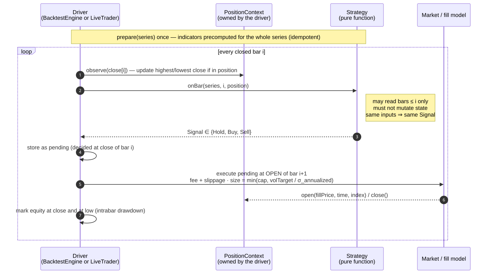

# Architecture

How the software is put together: the layers, what runs in which process and on
which thread, the state machines, the file formats, and the invariants the code
enforces. For *what the strategy does and why*, read [STRATEGY.md](STRATEGY.md);
for *how to operate it*, [RUNBOOK.md](../deploy/pi/RUNBOOK.md).

Every claim here was read out of the source. Line references are `file:line` at
the time of writing; treat them as signposts, not guarantees.

---

## 1. The one idea everything else hangs off

A strategy is a **pure function of `(series, bar index, position) → Signal`**.

```cpp
virtual void   prepare(const CandleSeries&) = 0;                  // once, whole series
virtual Signal onBar(const CandleSeries&, size_t i,
                     const PositionContext&) = 0;                 // O(1), no side effects
```
`src/strategy/strategy.h:62-79`

The position is **owned by the caller**, never by the strategy
(`strategy.h:10-26`). That one decision is what makes backtest and live
trading the same computation: `BacktestEngine` and `LiveTrader` construct their
own `PositionContext`, call the identical `observe → onBar` sequence, and get
the identical answer. It was learned the hard way — strategies used to keep an
internal `inPosition_` flag, and because the live loop re-runs `prepare()` every
poll, that flag was reset on every cycle: the bot could buy but **never sell**
(the rationale is written up at `strategy.h:10-26`).

Two consequences worth internalising:

- **`prepare()` must be idempotent**, because the live loop calls it every
  cycle (`live_trader.h:396`).
- **`onBar()` must not mutate anything** that changes a later answer. Same
  inputs, same signal — that is what lets `parity` replay history and expect
  the fills to match.

---

## 2. Layers and data flow



| layer | directory | what it owns |
|---|---|---|
| Data | `src/core/`, `src/data/` | the `.ctc` candle store, venue fetchers, HTTP |
| Indicators | `src/indicators/` | index-aligned, causal, NaN-until-warm |
| Strategy | `src/strategy/` | the `Strategy` interface, the zoo, gates, registry; `zoo/market_context.h` resolves a second instrument from `--data-dir` and aligns it by timestamp for cross-series families (`factor_trend`) |
| Backtest | `src/backtest/` | the bar loop, fill model, metrics |
| Search | `src/evolution/` | tournament, fitness, older GP searches |
| Live | `src/trading/` | `LiveTrader`, state, clients, trade log |
| CLI | `src/main.cpp` | every subcommand, flag parsing, config assembly |

A single binary, `cli_trader`, with subcommands: `fetch`, `validate`,
`backtest`, `portfolio`, `tournament`, `run`, `status`, `parity`, `balances`,
`list-strategies`, `evolve`, `evolve-strategy`, `order-spectrum`, `xsmom`.

**Config is assembled once and shared.** `buildBacktestConfig()` produces the
fees, slippage, fill timing and sizing used by backtest, portfolio, tournament
*and* the live loop, so "backtest, paper trading and evolution cannot silently
disagree about costs" (`main.cpp:261-263`).

---

## 3. Processes and threads



The honest summary: **almost everything is single-threaded.** The parallelism
lives in exactly one place, and the concurrency that matters is between OS
processes, not threads.

| path | model |
|---|---|
| `fetch`, `validate` | single-threaded; blocking libcurl (20 s timeout), rate-limiter sleeps 20 ms per probe, 50 ms between Poloniex pages |
| `backtest`, `portfolio` | single-threaded, no I/O in the loop at all — one sequential pass over bars (`engine.cpp:248-284`) |
| `tournament` | **the only `ThreadPool`** — `--jobs` threads, one task per individual per generation, main thread blocks on futures in order (`tournament.h:377-378, 781-798`) |
| `run` (live) | **single-threaded**; one OS process per symbol (`live_trader.h:276-308`) |

The live loop's only concurrency artifacts are a `SIGINT`/`SIGTERM` handler
writing an `atomic<bool>` (`live_trader.h:38-41`) and blocking sleeps: the poll
wait is sliced into 1-second chunks so a stop signal is noticed promptly
(`live_trader.h:302-304`).

Eight sleeves therefore means **eight independent OS processes**, each with its
own state directory entry and its own `SymbolLock` file (`live_trader.h:225-232`)
so two processes can never drive the same symbol. Process isolation is doing
the job threads would otherwise do, and one sleeve crashing cannot touch
another.

> **Stale comment:** `thread_pool.h:15-17` claims the pool is "used today by
> the data-fetching layer". It is not — the only instantiation is in the
> tournament.

---

## 4. The bar loop



The order of operations is the whole ballgame:

1. `position.observe(close[i])` — updates the high/low water marks **before**
   the strategy is consulted, so trailing stops see the current bar.
2. `onBar(series, i, position)` → `Signal`.
3. The signal becomes **pending**; it executes at **bar i+1's open**
   (`FillTiming::NextOpen`, the default). A signal computed from a close cannot
   be acted on before that close exists. `SameClose` exists only to measure how
   much the old, optimistic behaviour flattered a strategy.
4. Size = `min(cap, volTarget / σ_annualized)` using the volatility at the
   **signal** bar, not the fill bar (`engine.cpp:255, 184-194`).
5. Equity is marked at the close *and* at the bar's low, so drawdown is
   intrabar-aware.

**Skip-when-unmeasurable:** with vol targeting on and no volatility estimate
yet, `sizeFraction` returns 0 and the entry is *skipped* rather than falling
back to the cap (`engine.cpp:184-194`). Otherwise the least-informed bars get
the largest positions — and because every walk-forward fold restarts the
warm-up, that mis-sized entry landed on the first trade of every fold.

**No leverage, by construction:** `maxPositionFraction` is clamped to `[0,1]`
in the engine and values above 1.0 are rejected at flag-parse time, so a report
can never describe a position the engine could not take (`engine.cpp:185`,
`main.cpp:288-293`).

---

## 5. State machines

`LiveTrader` is where the state lives. There are five interlocking machines;
these two are the ones you need to understand.

### 5.1 The cycle gate



`lastAction` is the persisted record of **why a cycle did not trade** — because
"a bot that is quietly not trading looks exactly like a bot with nothing to do"
(`trading_state.h:63-70`).

Two behaviours worth calling out:

- **Replay, not just "the latest bar".** Every bar after
  `lastProcessedTimestamp` is fed through `observe → onBar`. A bot that was
  down for a day replays a day and fires **one** order, not a day of round
  trips. Backlog replay returns early with `replaying-backlog` and skips the
  poll sleep so it catches up fast (`live_trader.h:409-449`).
- **`halted-balance-mismatch` is self-clearing.** If the venue's base balance
  disagrees with the bot's books in *either* direction, it keeps polling and
  replaying but places no orders. The block is recomputed every reconciliation
  and clears by itself once they agree — no manual resume
  (`live_trader.h:552-557, 618-638`). The bot never adopts inventory it did not
  buy, so a manual holding is not sold out from under you.

### 5.2 Order idempotency



The client order id is deterministic — `ct-BTC_USDT-buy-a1-1787140800` — and
**written to disk and fsynced before the order is sent** (`live_trader.h:1000-1005`).
That ordering is the entire crash-safety story: a process that dies in the
milliseconds around the send restarts, finds its own id, and investigates
rather than resending.

The subtle part is the **unknown outcome**. If the order was accepted but the
read-back failed, the marker is deliberately *kept* and `orderAttempt` is *not*
advanced, so the retry reuses the same id and the venue rejects the duplicate
instead of filling twice (`live_trader.h:766-782, 976-998`).

### 5.3 The other three

| machine | states | notes |
|---|---|---|
| Account position | `scanning` / `bought` | driven by what the bot actually *owns* above a dust threshold; partial sells stay `bought` (`live_trader.h:786-905`) |
| Strategy notional position | flat / long | opens at the **replayed bar's close**, not the later real fill, so replay is deterministic across restarts (`live_trader.h:423-433`) |
| Venue order outcome | Open / PartiallyFilled / Filled / Cancelled / Rejected | an IOC that crossed part of the book is a successful *partial*, not a cancel (`poloniex_trading_client.h:555-591`) |

`entryIndex` is deliberately **not** persisted — indices shift when a store is
rebuilt — and is recovered each cycle by binary-searching the persisted
`stratEntryTime` in the freshly loaded series (`trading_state.h:120-135`).

---

## 6. Storage

**`data/SYMBOL_PERIOD.ctc`** — append-only binary. `CTC1` header plus fixed
48-byte records `{int64 timestamp, double o,h,l,c,v}`. Written with
`pwrite`+`fsync`; a rewrite goes through temp+fsync+rename. A file whose record
boundaries are not provably intact is refused rather than truncated
(`candle_store.cpp:488-532`).

The store must never contain a bar the venue will later change, so `fetch`
**drops the still-forming candle** and deliberately re-requests a few
already-stored bars to detect a venue re-basing — a stock split rescales the
whole Yahoo series, which would otherwise glue two price bases together with a
fake crash bar (`main.cpp:985-991`).

**`state_live/SYMBOL.state.json`** — the live bookkeeping, rewritten every cycle
and again before every order, always via temp + fsync + `.bak` + rename. A
corrupt file falls back to `.bak` or refuses to start rather than silently
resetting to a phantom balance (`trading_state.h:229-294`).

**`state_live/SYMBOL.trades.jsonl`** — append-only fill log, one JSON object per
fill, carrying the venue's raw response.

In memory, `CandleSeries` is **structure-of-arrays** — six parallel vectors, not
a vector of structs — so indicators run over contiguous doubles
(`candle.h:23-32`). `barsPerYear()` is **measured from the data's own time
span**, never derived from the nominal period, so daily equities correctly count
~252 bars/year instead of 365 (`candle.h:47-59`).

---

## 7. The search subsystem



The registry turns every strategy family into **a name plus a bounded parameter
vector** (`registry.h:27-33`), which is what lets one mutation/crossover
implementation serve all of them. Two structural genes — an optional regime gate
and a discrete volatility-target ladder — let the search reach combinations no
single family defines (`tournament.h:55-60`).

The safeguards are the point:

- **The holdout is sliced off before generation zero** and only opened after
  the loop, on the finalists (`tournament.h:300-301, 458-494`).
- **Control families** (`control_random`, `control_always_long`) are bred and
  selected like everything else, and the best control is *always* shown in the
  results table — it is the empirical null.
- **Fitness is a minimax**: the minimum across environments of (excess
  annualized Sharpe − quadratic drawdown penalty), so a candidate is only as
  good as its worst market (`fitness.h:55-80`).
- **Mutation reflects at bounds** rather than clamping, because clamping piles
  probability mass on the endpoints and a search that lives at its limits is
  reporting the limits (`tournament.h:628-635`).

---

## 8. Invariants the code actually enforces

1. **Causality.** Every precomputed value at index `i` depends only on inputs at
   `≤ i`. `experiments/tools/causality_check` verifies this by rewriting every
   bar after `i` and demanding no earlier signal moves — 24 families, zero
   violations.
2. **Fills are next-open.** Default everywhere; `same-close` warns when used.
3. **Both fees are charged to the trade**, so P&L and win rate are net of entry
   *and* exit (`engine.cpp:158-164`).
4. **The benchmark pays the same friction** — same fee, slippage, fill timing,
   and a forced liquidation at the end, so neither side gets a free exit.
5. **Atomic state writes**, always temp + fsync + rename with a `.bak`.
6. **One process per symbol**, enforced by a lockfile that reclaims a stale lock
   whose recorded pid is gone.
7. **Gates suppress entries only.** Sells and Holds always pass through, and an
   unmeasured statistic never blocks (`gates.h:11-15`).

---

## 9. Known asymmetries and traps

The repo's culture is to write these down rather than let someone rediscover
them.

- **`portfolio --start` starts indicators cold; `backtest --start` does not.**
  `backtest` carries an 80-bar warm-up prefix and scores only bars at/after
  `--start`; `portfolio` slices flush. Sub-period portfolio comparisons
  therefore understate the strategy slightly against the basket
  (`main.cpp:1161-1176` vs `loadEnvironments`).
- **`portfolio`'s basket benchmark uses a different friction model** from the
  single-instrument one: a single entry-cost multiplier, no exit liquidation
  (`main.cpp:2066-2077`).
- **Drawdown peaks are tracked over closes only.** "Intrabar-aware" means
  intrabar *troughs* against close-based peaks (`engine.cpp:44-53`).
- **Four families break the purity contract** by mutating members inside
  `onBar()` — `darvas`, `fib_ichimoku`, `patterns`, `pencil_extrap`. They pass
  the causality check (which tests look-ahead, not idempotency) but are
  path-dependent. None is in the live ensemble.
- **"Default tsmom" means two different things**: the registry default vector
  uses `entryThresholdSigmas=0.5`, while `TsmomParams{}` uses an absolute 5%
  threshold. Eight names bypass the registry in `makeStrategy` unless
  `--sparams` is given (`main.cpp:534-539`).
- **Only the Hurst gate is reachable from the CLI.** The `pe`, `hawkes` and `vr`
  gates exist only inside the tournament, so a finalist genome naming one of
  them cannot be reproduced with `backtest` alone.
- **`Environment` is two different structs** — `{label, series}` in `main.cpp`
  and `{label, train, holdoutFull, holdoutFrom}` in `tournament.h`.

---

## 10. Build and deployment

```sh
cmake -S . -B build -DCMAKE_BUILD_TYPE=Release && cmake --build build -j
```

C++17. `find_package` for libcurl, OpenSSL and Threads; `nlohmann/json` is
fetched by CMake `FetchContent`. Sources are globbed with `CONFIGURE_DEPENDS`,
so a new header needs no CMake edit. On a Pi 3 the first build takes 20–40
minutes, mostly the JSON library.

**Deployment** is a systemd template unit, `cli-trader@SYMBOL.service`,
instantiated eight times. Its notable directives:

- `After=network-online.target time-sync.target` — a Pi has no RTC, and HMAC
  signing fails outright on a wrong clock, so the sleeves wait for NTP.
- `Restart=on-failure`, `RestartSec=60` — a **crash** is restarted; a clean
  `systemctl stop` stays stopped, so the operator's stop command actually stops.
- `ExecStartPre` guard — refuses to start `MODE=paper` against `state_live/`, or
  live against anything else. Added after a config push did exactly that.
- `ExecStartPre` stagger — `sleep $(cksum of instance name % 20)`, so eight
  sleeves do not hit the API in the same instant after a reboot.
- **`.env` is deliberately *not* an `EnvironmentFile`.** systemd rejects names
  containing dashes (`API-KEY`) — and logs the rejected assignment, secret
  included, to the journal. The binary parses `.env` itself from its working
  directory.

A `cli-trader-healthcheck.timer` runs `scripts/check_pi.py` every 10 minutes
(`OnBootSec=5min`, `Persistent=true`). It checks unit state, per-sleeve
staleness, halts, errors, **NTP synchronisation**, free disk and the Telegram
unit, and is silent unless something is wrong.

`cli-trader-telegram.service` is the phone side, and the only process here that
talks to Telegram. It answers the read-only commands, and between long polls it
runs `scripts/trade_alerts.py`, which tails `state_live/<SYM>.trades.jsonl` and
pushes one message per fill. **The alerter reads the trade logs; it is not
wired into `LiveTrader`.** Putting an HTTPS call to a third party between a
fill and its state save would make a Telegram outage able to stall — or kill —
a process that has just bought coins and not yet recorded owning them, which is
precisely the condition the `halted-balance-mismatch` guard exists to catch.
Tailing the log carries the same information and cannot touch the book. Its
cursor lives in `logs_pi/.trade_alert_state.json`; an unknown sleeve is adopted
at the log's current length, so a fresh install announces the next fill rather
than replaying history.

---

## 11. Diagram sources

The diagrams are Mermaid, with sources in [`docs/src/`](src/) and rendered
SVG/PNG in [`docs/img/`](img/). To regenerate after an edit, from the repo root:

```sh
cd docs && npx -y @mermaid-js/mermaid-cli -i src/NAME.mmd -o img/NAME.svg -b transparent
```
